<p align="center">
  
</p>

<p align="center">
  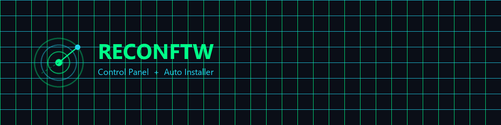
</p>

<p align="center">
  <a href="https://t.me/zyntarvo"></a>
  &nbsp;
  
  &nbsp;
  
  &nbsp;
  
  &nbsp;
  
</p>

<p align="center"><b>Created by ZynTarvo</b> · Telegram: <a href="https://t.me/zyntarvo">@zyntarvo</a> · <i>Nothing Is Impossible</i></p>

---

A visual **Control Panel** for [reconFTW](https://github.com/six2dez/reconftw) — plus a one-click Windows installer.

No Linux wizardry. No `install.sh` in a raw SSH session. Enter the server IP and password, click **INSTALL**, and get a working recon engine with a browser dashboard: scans, jobs, findings, reports, modules, API keys.

Built for pentesters, bug bounty hunters, and red teamers who want [six2dez/reconftw](https://github.com/six2dez/reconftw) running in minutes instead of fighting Go, PATH, and fifty CLI tools.

- Auto-install on Ubuntu (Go via apt, clone reconFTW, tools, panel, systemd)
- Web panel with login — same credentials as SSH
- Launch recon / subdomain / passive / web / OSINT / zen / custom scans from the browser
- Jobs with Acunetix-style severity cards, category drill-down, live log
- Consolidated HTML report viewer, file explorer, module switches
- API keys stored **only on your VPS** — never shipped in this repository
- Host Health (CPU, RAM, disk, traffic) and systemd service control
- A running scan survives a panel restart (`KillMode=process`)

## Languages & stack

| Layer | Language | What it is |
|---|---|---|
| Installer GUI | **Python 3** + Tkinter | Windows app (`reconftw_setup.py`), SSH via Paramiko |
| Control panel | **Python 3** | Flask + Flask-SocketIO (`payload/app.py`) |
| Findings engine | **Python 3** | Nuclei JSONL parser, CWE / Acunetix / OWASP severity remap |
| UI | **HTML · CSS · JavaScript** | Single-page panel + login (`payload/templates/`) |
| Marks | **SVG** | Radar logo and favicon |
| Launchers | **Batch** | `START.bat`, `build.bat` |
| On the server | **Bash** (reconFTW) · **Go** tools · **systemd** | Engine cloned from upstream, not rewritten here |

GitHub’s language bar is driven by the files above (Python + HTML dominate; docs and screenshots are marked as documentation).

## A note on authorship

This project does **not** steal anyone’s work.

[reconFTW](https://github.com/six2dez/reconftw) is the original reconnaissance orchestrator by **six2dez**. We clone it cleanly, then add a web control panel and a one-click installer on top — so people who are just starting (and people who are tired of the terminal) can run the same engine without living in Bash.

Think of it as a companion: the same reconFTW, made simpler to install and operate.

## Install

**Requirements:** a Windows PC with Python 3, and a **fresh** Ubuntu 22.04 / 24.04 / 26.04 server with root SSH. About 2 vCPU and 4 GB RAM is enough (swap is added automatically if RAM is low).

1. Clone this repository
2. Double-click `START.bat` (or run `python reconftw_setup.py`)
3. Fill in **SERVER IP**, **SSH port**, **login**, **password** (panel port defaults to `8443`)
4. Choose a button:
   - **INSTALL** — full stack on a clean box: apt packages, Go (`golang-go`, not the broken `go.dev` tarball), clone reconFTW, `install.sh` + `--tools`, PATH glue, upload the panel, systemd
   - **INSTALL ONLY CP** — panel only. The engine must already exist at `/root/reconftw`

<p align="center">
  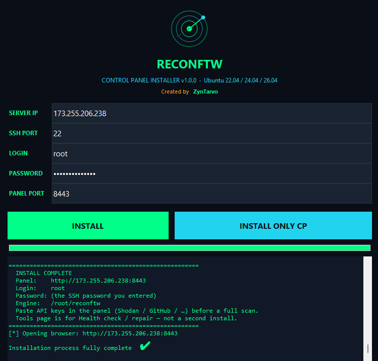
</p>

After a full **INSTALL** you do **not** need Tools → Install. Open the panel, paste optional API keys, start a scan.

Panel URL: `http://YOUR_SERVER_IP:8443`  
Login is the same as SSH (user + password).

Typical full install: **20–60 minutes**. The installer tails `install.sh` live.

## Login

<p align="center">
  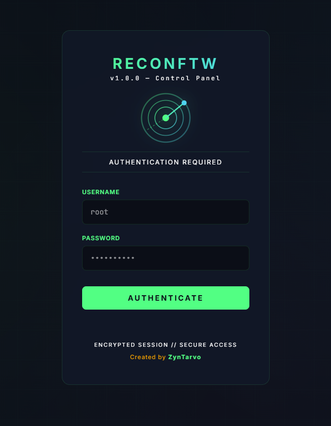
</p>

Encrypted session cookie, username / password, radar mark. Created by ZynTarvo.

Unauthorized scanning is illegal. The New Scan page requires an authorization checkbox before a job is queued.

## Control Panel — every menu

The sidebar is the whole product. Each page below is what you see after login.

### Dashboard

Home screen. At a glance:

| Card | What it shows |
|---|---|
| **Engine** | Whether reconFTW is present and healthy |
| **Running jobs** | How many scans are in flight right now (not the last job id) |
| **Finished scans** | Completed jobs |
| **Result folders** | Domains under `/root/reconftw/Recon` |
| **Recent jobs** | Latest rows with open / delete |

A green **ENGINE READY** pill sits at the bottom of the sidebar when the binary and tools are on PATH.

### New Scan

<p align="center">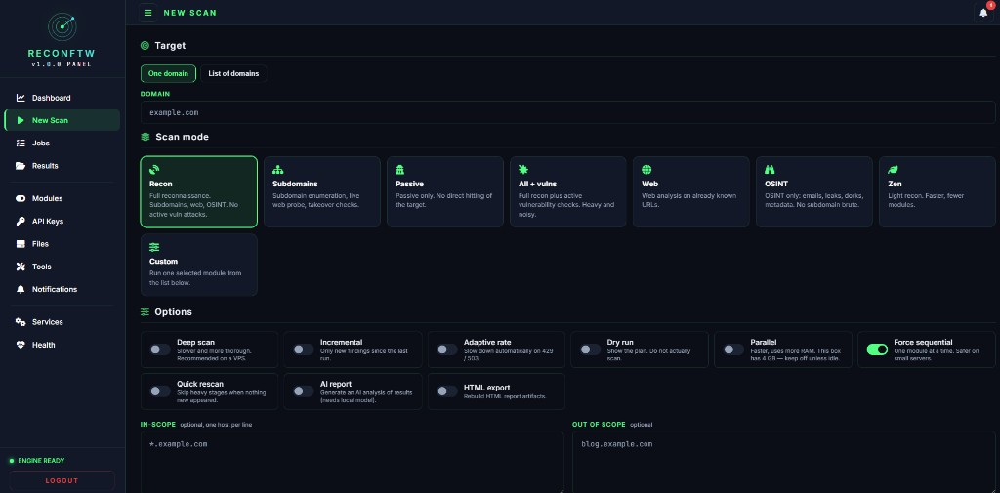</p>

Queue a reconFTW job without touching the CLI.

**Target**

- **One domain** — single host (`example.com`)
- **List of domains** — one per line

**Scan mode**

| Mode | What reconFTW does |
|---|---|
| **Recon** (`-r`) | Full reconnaissance: subdomains, web, OSINT. No active vuln attacks |
| **Subdomains** (`-s`) | Enumeration, live web probe, takeover checks |
| **Passive** (`-p`) | Passive only. No direct hitting of the target |
| **All + vulns** (`-a`) | Full recon plus active vulnerability checks. Heavy and noisy |
| **Web** (`-w`) | Web analysis on already known URLs |
| **OSINT** (`-n`) | Emails, leaks, dorks, metadata. No subdomain brute |
| **Zen** (`-z`) | Light recon. Faster, fewer modules |
| **Custom** (`-c`) | Run one selected module from the dropdown |

**Options**

| Switch | Flag | Meaning |
|---|---|---|
| Deep scan | `--deep` | Slower, more thorough. Recommended on a VPS |
| Incremental | `--incremental` | Only new findings since the last run |
| Adaptive rate | `--adaptive-rate` | Slow down on HTTP 429 / 503 |
| Dry run | `--dry-run` | Print the plan, do not scan |
| Parallel | `--parallel` | Faster, uses more RAM |
| Force sequential | `--no-parallel` | One module at a time. Safer on small servers |
| Quick rescan | `--quick-rescan` | Skip heavy stages when nothing new appeared |
| AI report | `-y` | Narrative markdown via **local** Ollama (`reconftw_ai`). No cloud API key. Needs RAM the typical 4 GB VPS does not have |
| HTML export | `--export html` | Rebuild HTML report artifacts |

Optional **in-scope** / **out of scope** lists (one host per line). Then the authorization checkbox and **Start scan**.

Restarting the panel does **not** kill an in-flight scan.

### Jobs

<p align="center">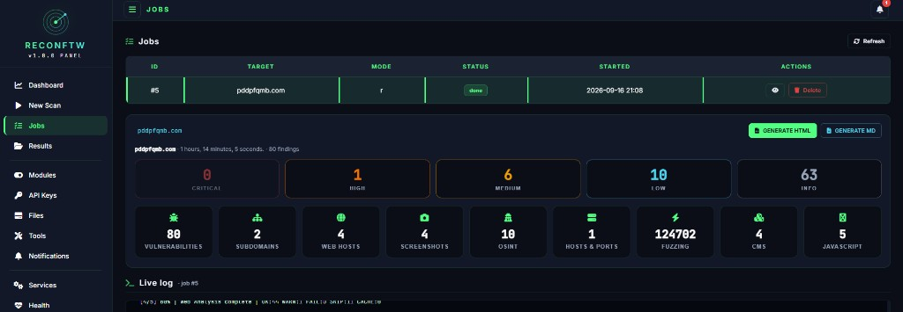</p>

Every scan you launched. Table columns: **ID**, **Target**, **Mode**, **Status**, **Started**, **Actions** (open / delete).

Click a finished row. The page expands in place (no extra window) with:

- **Severity cards** — Critical / High / Medium / Low / Info  
  Nuclei’s blanket `info` is remapped from CWE / Acunetix / OWASP (cookie flags → Low, missing HSTS / SRI → Medium, HTTPS-to-HTTP → High, recon fingerprints stay Info). Nuclei High / Critical is never downgraded.
- **Category cards** — Vulnerabilities, Subdomains, Web hosts, Screenshots, OSINT, Hosts & ports, Fuzzing, CMS, JavaScript
- Breadcrumbs (`target / Vulnerabilities / …`) so you can drill down and go back
- **GENERATE HTML** / **GENERATE MD** downloads
- **Live log** under the table — same stream reconFTW prints to the terminal

<p align="center">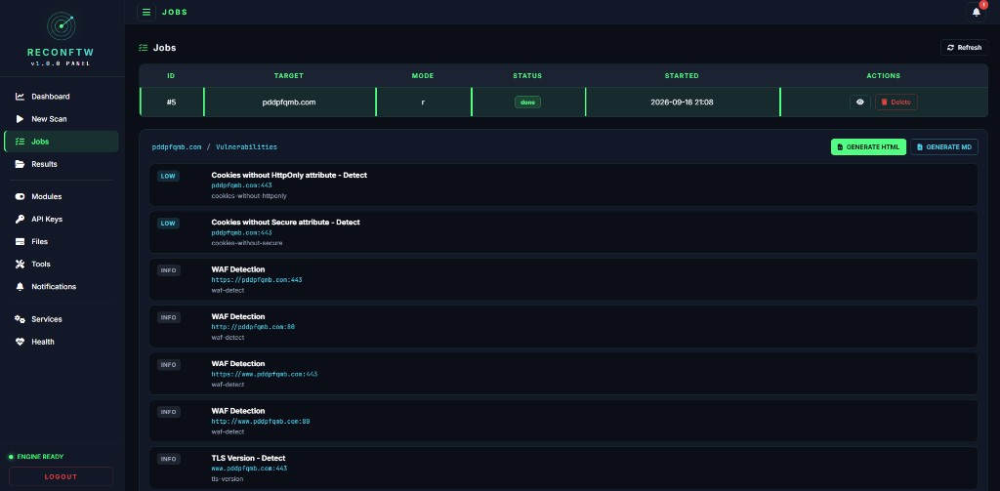</p>

Each finding shows the remapped pill, the original nuclei severity when it differs, matcher, CWE, and extracted evidence.

### Results

<p align="center">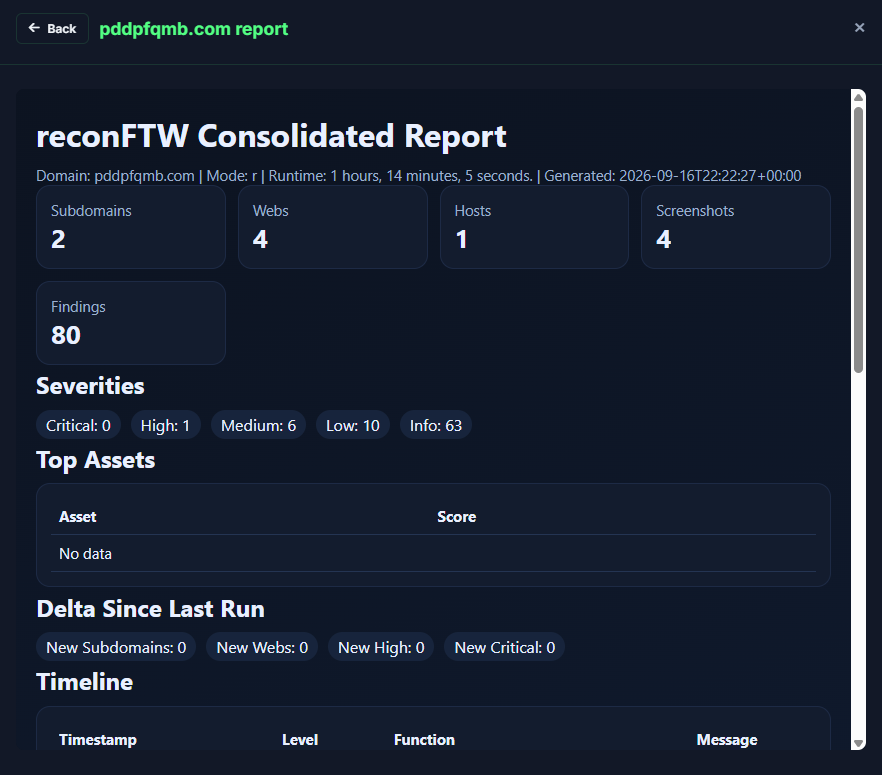</p>

One card per scanned domain. Open the reconFTW **Consolidated Report**:

- Subdomains / Webs / Hosts / Screenshots / Findings counts
- **Severities** — same totals as the Jobs cards (not the raw nuclei “everything is Info” view)
- Quick Links into webs, screenshots, nuclei output, OSINT, fuzzing, …
- **← Back** returns to the report (from a file, a directory, or a missing path)

Missing files (for example a takeover list that was never produced) open a dark “not produced” page with Back — they stay clickable.

### Files

<p align="center">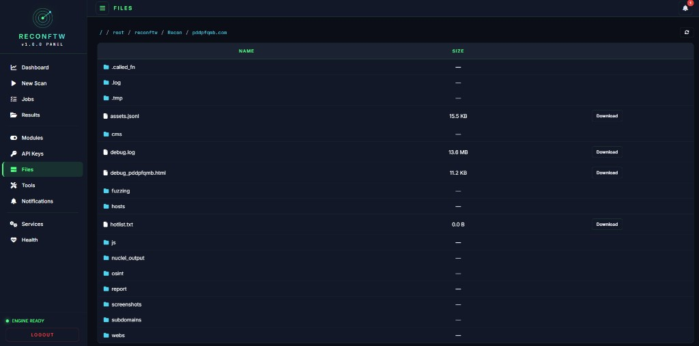</p>

A file explorer over `/root/reconftw/Recon/<domain>/`. Breadcrumbs, folders, download. Same tree reconFTW writes: `webs`, `subdomains`, `osint`, `nuclei_output`, `screenshots`, `fuzzing`, `report`, …

### Modules

<p align="center">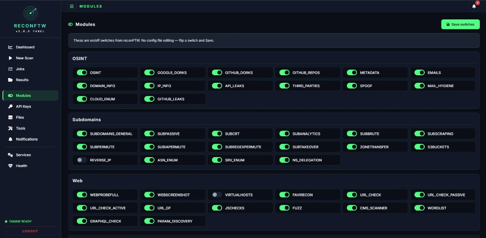</p>

<p align="center">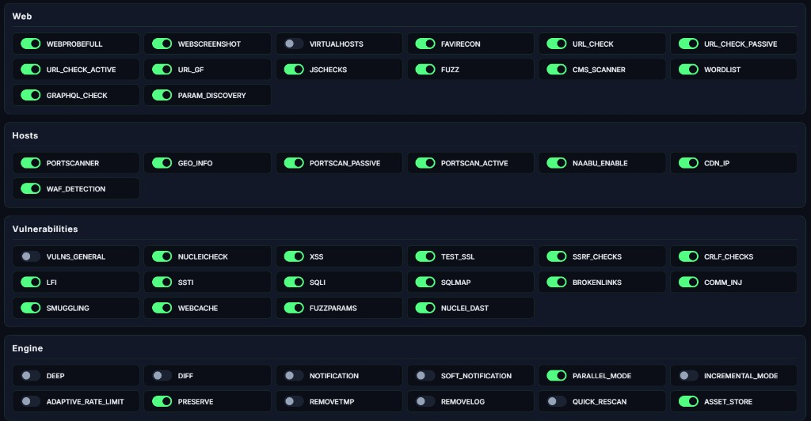</p>

On/off switches from `reconftw.cfg`. No hand-editing the config — flip a switch and **Save switches**.

Groups include:

| Group | Examples |
|---|---|
| **OSINT** | Google / GitHub dorks, emails, metadata, cloud enum, GitHub leaks |
| **Subdomains** | Passive, CT, analytics, brute, permutations, takeover, zone transfer, S3 |
| **Web** | Probe, screenshots, favicon, URL checks, JS, fuzz, CMS, GraphQL, params |
| **Hosts** | Port scan, geo, CDN, WAF |
| **Vulnerabilities** | Nuclei, XSS, SSL, SSRF, CRLF, LFI, SSTI, SQLi, sqlmap, nuclei DAST |
| **Engine** | Deep, diff, notifications, parallel, incremental, preserve, asset store |

### API Keys

<p align="center">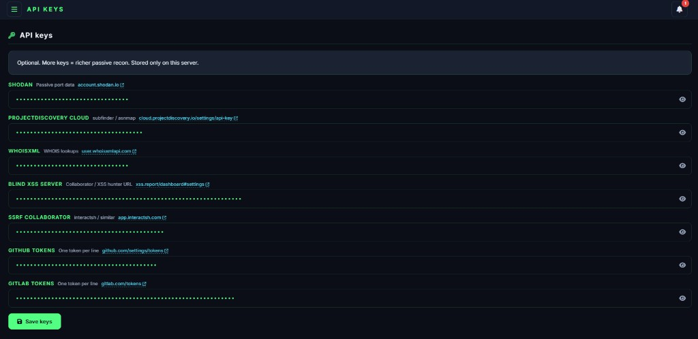</p>

Optional. More keys = richer **passive** recon. Each field has an eye toggle and a link to the vendor’s token page.

| Key | Used for |
|---|---|
| **Shodan** | Passive port data |
| **ProjectDiscovery Cloud** | subfinder / asnmap |
| **WhoisXML** | WHOIS lookups |
| **Blind XSS server** | Collaborator / XSS hunter URL |
| **SSRF collaborator** | interactsh / similar |
| **GitHub tokens** | One token per line |
| **GitLab tokens** | One token per line |

Stored only in `secrets.cfg` (and token files) **on that server**. This GitHub repo ships empty placeholders. Saving keys in the panel does not send them anywhere else.

### Tools

Health check / repair for the engine after INSTALL. You should **not** need a second full install from here. **Install / continue** re-runs reconFTW’s installer if something is missing; **Health check** verifies `subfinder`, `nuclei`, and friends on PATH.

### Notifications

Telegram alerts when a scan starts, stops, or finishes.

- Enable toggle
- Bot token
- Chat ID
- **Save** / **Send test**

The bell in the top bar is the in-panel notification drawer (mark all read / clear).

### Services

systemd units on the box. Table: **Name**, **State**, **PID**, start / stop / restart. The journal of the selected unit streams underneath. `reconftw-panel` uses `KillMode=process` so stopping or restarting the panel does not murder a running `reconftw.sh`.

### Health

<p align="center">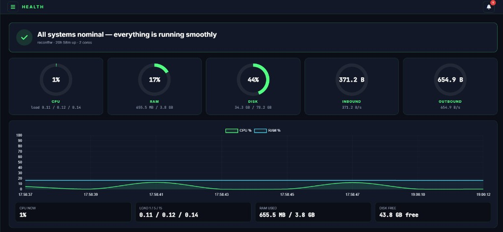</p>

Live host telemetry:

| Gauge | Meaning |
|---|---|
| **CPU** | Percent + load 1 / 5 / 15 |
| **RAM** | Used vs total |
| **Disk** | Used vs size, free space |
| **Inbound / Outbound** | NIC bytes per second |
| **Chart** | CPU % and RAM % over time |

Banner: *All systems nominal* when the box is fine.

## Layout

```
START.bat              → launch the GUI installer
build.bat              → optional PyInstaller EXE
reconftw_setup.py      → SSH installer (Ubuntu 22.04–26.04)
payload/               → panel uploaded to /root/reconftw-panel
  app.py               → Flask + SocketIO
  findings.py          → job findings aggregator
  severity.py          → CWE / Acunetix / OWASP remap
  requirements.txt     → flask, flask-socketio, simple-websocket
  templates/           → login.html + index.html
  static/              → logo.svg, favicon.svg
docs/screenshots/      → UI shots used in this README
```

On the server after INSTALL:

```
/root/reconftw         → six2dez/reconftw engine
/root/reconftw-panel   → this control panel (venv + systemd)
/root/Tools            → Go / uv tools
http://IP:8443         → panel
```

## Support the work

If this panel saved you time and you want to say thank you, USDT on **Ethereum (ERC-20)** is enough:

```
0xFd051b2267b75C9c2513Cb9BAd546e3C51d5dB44
```

No pressure. Use the tool, learn, and pass it on.

## Contact

Telegram: [@zyntarvo](https://t.me/zyntarvo)

## Credits

- **reconFTW** — [six2dez](https://github.com/six2dez/reconftw)
- **Control Panel + Auto Installer** — [ZynTarvo](https://github.com/zyntarvo) · Telegram [@zyntarvo](https://t.me/zyntarvo)

<p align="center"><i>ZynTarvo — Nothing Is Impossible</i></p>
